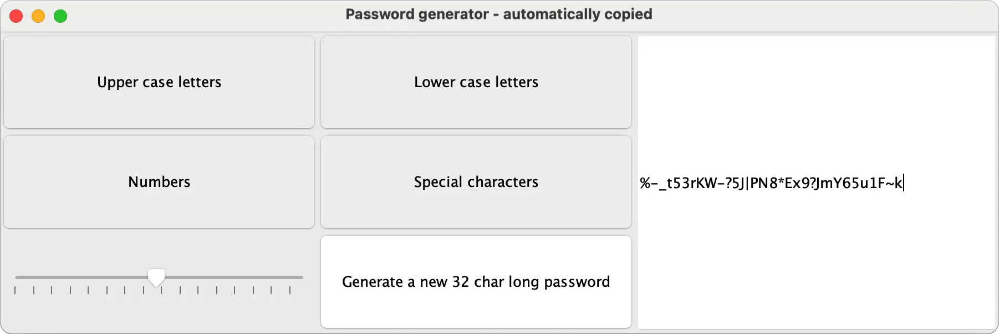

# Password generator 

A small Java GUI app that generates a random password that I made a couple years ago (I don't recall when exactly).

I pimped it up a bit and uploaded it here.



## How to:
In case you actually want to use this yourself, you first need to install this dependency of mine. Which can be downloaded from [here](https://github.com/telos-matter/JavaUtil) and then installed locally. All like so:
```bash
git clone https://github.com/telos-matter/JavaUtil
cd JavaUtil
mvn clean install
```

And then you can simply run this app with:
```bash
mvn clean compile exec:java
```
